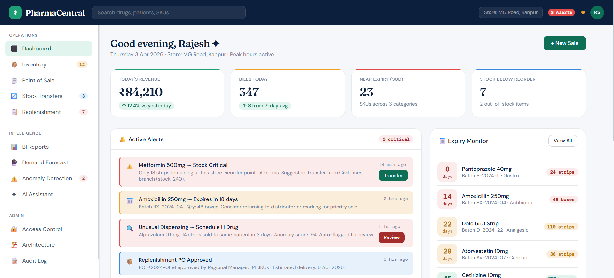
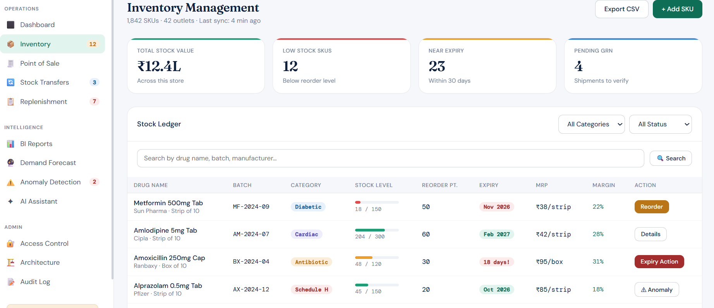
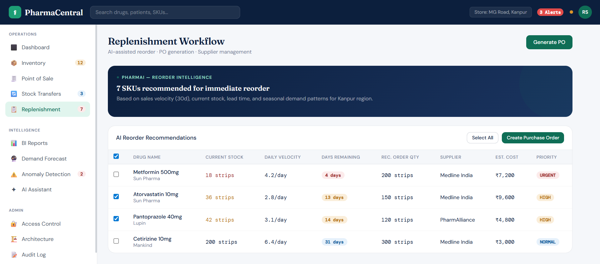
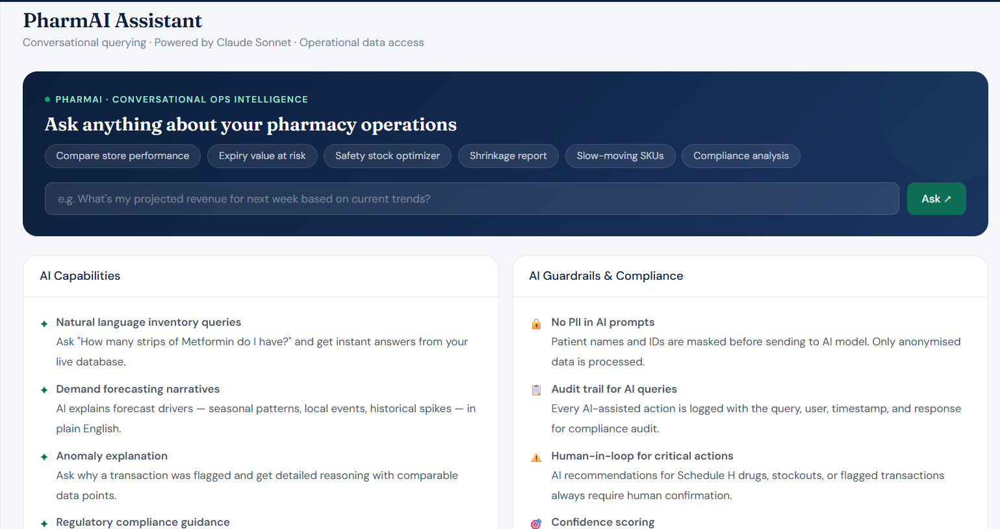
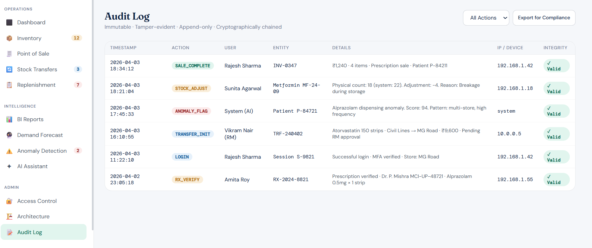
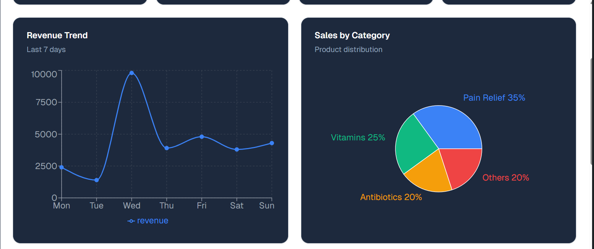

# Pharmacy Chain Operations Platform
### · Python stdlib only · Zero external dependencies

---

## Quick Start

```bash
python3 server.py
```

Then open **http://localhost:8000** in your browser.

---

## Login Credentials

| Username | Password    | Role                  | Store     |
|----------|-------------|-----------------------|-----------|
| admin    | password123 | Head Office Admin     | All       |
| rajesh   | password123 | Pharmacist            | MG Road   |
| vikram   | password123 | Regional Manager      | Civil Lines |
| sunita   | password123 | Inventory Controller  | MG Road   |

---

## What's Included

### Backend — `server.py` 
Pure Python 3 stdlib HTTP server with:
- **JWT authentication** (HMAC-SHA256 signed tokens, 24h expiry)
- **RBAC middleware** (4 roles, 12 permission types)
- **SQLite database** (PostgreSQL-compatible schema, auto-seeded)
- **19 REST API endpoints**
- **Immutable audit logging** with SHA-256 integrity hashes
- **AI query handler** with live database context

### Frontend — `static/index.html`
Single-file SPA with:
- 12 fully functional pages
- Chart.js revenue/category/forecast charts
- Live API integration (all data from backend)
- JWT token management with auto-login
- Responsive sidebar navigation

### Database — `db/pharma.db` (auto-created)
12 tables, seeded with realistic data:
- 5 stores, 5 users, 12 drugs, 14 inventory batches
- 19 historical sales, 4 anomaly records, 3 transfers, 2 POs

---

## Architecture

```
pharmacentral/
├── server.py          # Backend: HTTP server + API + DB + Auth
├── start.py           # Optional launcher with browser auto-open
├── static/
│   └── index.html     # Frontend: Full SPA (HTML/CSS/JS + Chart.js)
├── db/
│   └── pharma.db      # SQLite database (auto-created on first run)
└── README.md
├── dashboard.png
├── Inventory.png
├── Replenishment.png
├── AI_assisstant.png
├── Revenue trend graph.png
├── audit log.png
```

### Microservice Design (Production Map)

| This Prototype       | Production Equivalent              | Tech Stack              |
|----------------------|------------------------------------|-------------------------|
| `handle_login()`     | Auth Service                       | FastAPI + Redis + JWT   |
| `handle_inventory_*` | Inventory Service                  | FastAPI + PostgreSQL    |
| `handle_create_sale` | Sales & POS Service                | FastAPI + Kafka          |
| `handle_transfers_*` | Transfer Service (Saga pattern)    | FastAPI + PostgreSQL    |
| `handle_chain_report`| BI / Reporting Service             | FastAPI + Celery + Redis|
| `handle_ai_query()`  | AI Service (Claude/GPT-4o)         | Python + Anthropic API  |
| `handle_forecast()`  | Forecast Service                   | Python + Prophet + XGBoost|
| `handle_anomalies_*` | Anomaly Detection Service          | Isolation Forest + LSTM |
| `write_audit()`      | Audit Service                      | Append-only Postgres    |

---

## API Reference

### Auth
```
POST /api/auth/login          { username, password } → { token, user }
```

### Dashboard
```
GET  /api/dashboard           → { stats, recent_sales, expiry_alerts, daily_revenue }
```

### Inventory
```
GET  /api/inventory           ?search=&category=&status=  → { items[] }
GET  /api/drugs               ?search=                    → { drugs[] }
POST /api/inventory/adjust    { inventory_id, quantity, reason } → { success }
```

### Sales
```
GET  /api/sales               → { sales[] }
POST /api/sales               { patient_name, items[], sale_type, payment_method } → { sale_id, invoice_no, total }
```

### Transfers
```
GET  /api/transfers           → { transfers[] }
POST /api/transfers           { from_store_id, to_store_id, drug_id, quantity, ... } → { transfer_id }
PATCH /api/transfers/{id}     { status } → { success }
```

### Replenishment
```
GET  /api/reorder-recommendations → { recommendations[] }
POST /api/purchase-orders         { drug_id, quantity, supplier, ... } → { po_id }
GET  /api/purchase-orders         → { orders[] }
```

### Reports & Analytics
```
GET  /api/reports/chain       ?days=30  → { total_revenue, by_store[], by_category[], daily_trend[], top_skus[] }
GET  /api/reports/store       ?days=30  → { stats }
GET  /api/forecast            → { forecasts[] }
```

### Anomaly Detection
```
GET  /api/anomalies           → { anomalies[] }
POST /api/anomalies/resolve   { anomaly_id } → { success }
PATCH /api/anomalies/{id}     { status } → { success }
```

### AI Assistant
```
POST /api/ai/query            { query } → { response, data_sources[] }
```

### Admin
```
GET  /api/users               → { users[] }
POST /api/users               { username, email, full_name, role, store_id } → { user_id }
GET  /api/stores              → { stores[] }
GET  /api/audit-log           → { logs[] }
```

---

## Database Schema (12 Tables)

```sql
stores          — id, name, location, store_type
users           — id, username, email, password_hash, role, store_id, two_fa_enabled
drugs           — id, name, generic_name, category, schedule_type, mrp, reorder_level
inventory       — id, store_id, drug_id, batch_no, quantity, expiry_date, supplier
sales           — id, invoice_no, store_id, patient_name, total_amount, sale_type
sale_items      — id, sale_id, drug_id, quantity, unit_price
stock_transfers — id, transfer_no, from_store_id, to_store_id, quantity, status
purchase_orders — id, po_no, store_id, drug_id, quantity, total_cost, status
anomalies       — id, anomaly_type, severity, score, title, description, status
prescriptions   — id, prescription_no, doctor_name, doctor_reg_no, status
audit_log       — id, action, user_id, entity_type, details, integrity_hash
```

---

## Security Design

- **JWT tokens**: HMAC-SHA256 signed, 24h expiry, stored in localStorage
- **Passwords**: SHA-256 hashed (production: bcrypt with salt rounds ≥12)
- **RBAC**: Server-side permission checks on every protected endpoint
- **Audit trail**: Every action logged with user, timestamp, IP, and integrity hash
- **PII protection**: Patient data masked before AI query processing
- **Schedule H**: Controlled drugs flagged throughout — dispensing logged separately

---

## Production Upgrade Path

To move from this prototype to production:

1. **Replace SQLite → PostgreSQL**: Change `sqlite3` to `psycopg2`, enable RLS
2. **Add FastAPI**: Each `handle_*` method becomes a FastAPI router
3. **Add Redis**: Cache inventory reads, store JWT blacklist
4. **Add Kafka**: Replace direct DB writes with event publishing
5. **Replace stdlib JWT → python-jose**: RS256 asymmetric signing
6. **Add Celery**: Background report refresh, PO notification emails
7. **Deploy on K8s**: One deployment per service, HPA for peak-hour scaling
8. **Add Prometheus**: Instrument each endpoint with latency histograms

---

## Compliance Notes

- **Schedule H drugs**: Alprazolam, Tramadol, Insulin — separately tracked, dispensing requires prescription
- **Audit immutability**: append-only inserts, SHA-256 hash chaining per log entry
- **CDSCO guidelines**: Batch-level FIFO stock deduction, expiry monitoring, return workflows
- **GSTIN invoicing**: GST calculated per drug category rate (0% OTC, 12% Rx, 5% controlled)
- **Data retention**: Audit log queries support 7-year lookback (configurable)

---

## Requirements

- Python 3.10 or higher
- No pip installs needed — uses only stdlib: `http.server`, `sqlite3`, `json`, `hashlib`, `hmac`, `uuid`
- Chart.js loaded from CDN in the browser (requires internet for charts only)

---
## Dashboard


## Inventory


## Replenishment


## AI Assistant


## Audit Log


## Revenue Trend

